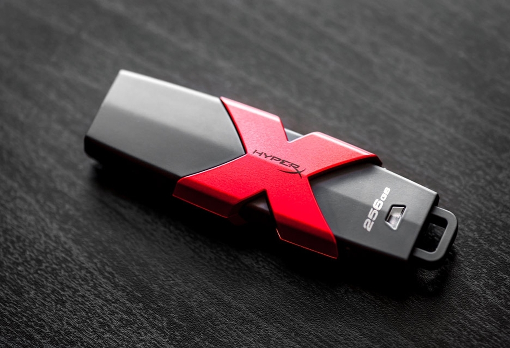
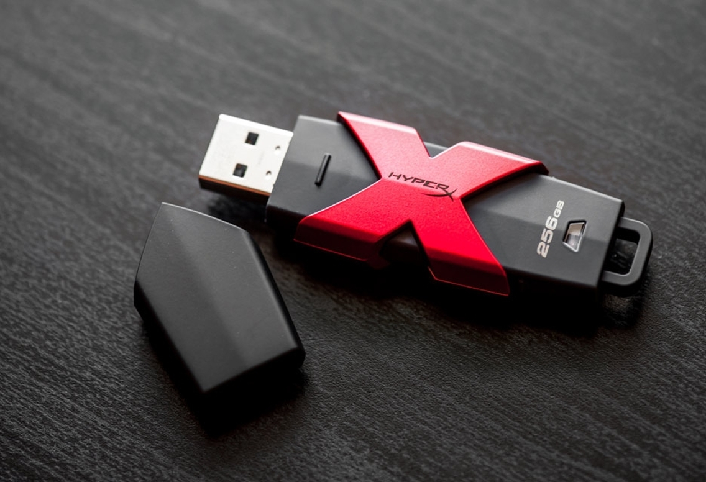

# Wprowadzenie

HyperX Savage 256 GB to bardzo szybki, pojemny i solidny pendrive USB 3.1, idealny do przenoszenia dużej ilości plików.

  <ul class="orbit-container">
    <button class="orbit-previous">Previous Slide&#9664;&#xFE0E;</button>
    <button class="orbit-next">Next Slide&#9654;&#xFE0E;</button>
  <li class="is-active orbit-slide">
        
  </li>
<li class="orbit-slide">
      
  </li>  
</ul>
<nav class="orbit-bullets">
  <button class="is-active" data-slide="0">Pendrive</button>
  <button data-slide="1">Current Slide</button>
</nav>

---

## Pojemna pamięć flash USB – idealna na co dzień

Żyjemy w czasach kiedy liczy się efektywność. Mamy coraz więcej zadań na głowie, więc staramy się wykonywać je szybko i bezproblemowo. Dotyczy to również nośników pamięci. Wydaje się, że era masowego wypalania płyt optycznych minęła już bezpowrotnie. Owszem, nośniki DVD-R są dość tanie w przeliczeniu na gigabajt, ale ich nagrywanie trwa bardzo długo. W dodatku wiele nowych laptopów i komputerów stacjonarnych sprzedawanych jest bez napędu optycznego.

Wciąż nieźle trzymają się przenośne dyski twarde ze złączem USB. Mają dużą pojemność, ale niestety są wrażliwe na wstrząsy. Upadek dysku HDD często kończy się jego uszkodzeniem i utratą zapisanych na nim plików.

Można wyeliminować ten problem używając nośnika SSD w obudowie USB, albo… małego, lekkiego i bardzo szybkiego pendrive'a takiego jak HyperX Savage.

# USB 3.1 czy 3.0?

Na początek chciałbym rozwiać jedną, zasadniczą wątpliwość. Producent na swojej stronie podaje, że opisywany pendrive ma złącze „USB 3.1 Gen 1 (USB 3.0)”. Co to oznacza? Na jaką szybkość można liczyć?

W praktyce USB 3.0 zostało przemianowane na USB 3.1 gen.1, więc są to dokładnie takie same standardy (SuperSpeed). Teoretyczna przepustowość to 5 Gb/s, a nie 10 Gb/s jak w standardzie USB 3.1 gen.2 (SuperSpeed+).
Realnie producent deklaruje odczyt maksymalny na poziomie 350 MB/s i zapis 250 MB/s. To bardzo dobre osiągi. Jeśli potwierdzą się one w praktyce, to pendrive HyperX Savage zapewni 2-3 razy szybsze kopiowanie plików niż z tradycyjnego przenośnego dysku twardego. Wyniki testów umieściłem niżej.

# Czy nada się do mojego komputera?

HyperX Savage będzie działał ze starszymi komputerami wyposażonymi w USB 2.0, ale oczekiwać należy wtedy znacznie wolniejszego zapisu i odczytu danych. Najbardziej polecany jest do użytku z nowoczesnymi komputerami wyposażonymi w złącze USB 3.0 lub 3.1.

Producent deklaruje prawidłową pracę na następujących systemach:

Windows 10
Windows 8.1
Windows 8
Windows 7 (SP1)
Windows Vista (SP2)
Mac OS X v.10.8.x+
Linux v.2.6.x+
Chrome OS
Trzeba jednak pamiętać, że pendrive sformatowany jest fabrycznie w systemie plików exFAT. Ja testowałem go na Windowsie 10, na którym działał bez problemu, ale np. na Linuksie (Ubuntu 15.10) domyślnie nie był „montowany” prawidłowo. Trzeba było doinstalować narzędzia exfat-utils i exfat-fuse.

# Jakość wykonania

Produkty marki HyperX przeznaczone są głównie dla graczy, więc pendrive Savage utrzymany jest w nowoczesnej, agresywnej, czarno-czerwonej kolorystyce. Nośnik sprawia bardzo dobre wrażenie jakościowe. Waży 26 gramów i ma solidną, zwartą obudowę.

Czarną powierzchnię wykonano z matowego, przyjemnego w dotyku tworzywa sztucznego, odpornego na typowe zarysowania. Charakterystyczny, czerwony „X” jest z kolei metalowy. Oprócz funkcji dekoracyjnej pełni on jeszcze jedną, ważną rolę – służy do chłodzenia pamięci. HyperX Savage jest tak szybki, że w czasie długiej, intensywnej pracy potrafi się wyraźnie rozgrzać. Metalowy radiator jest więc konieczny – chroni komponenty przed uszkodzeniem.

 

Po zdjęciu dużej, plastikowej osłony ujrzymy tradycyjny wtyk USB typu A. Obudowa ma 7,6 cm długości, 2,3 cm szerokości i 1,2 cm grubości. Zakończona jest solidnym, grubym mocowaniem do smyczki. Producent wbudował też niebieską diodę sygnalizującą aktywność pendrive'a.

# Podsumowanie

Jeśli szukacie bardzo szybkiego i przy okazji atrakcyjnie wyglądającego pendrive'a, to HyperX Savage 256 GB jest bardzo godny polecenia. Na komputerach z portem USB 3.0 można oczekiwać bardzo szybkiego kopiowania plików w obie strony. Pamięć nadaje się szczególnie dobrze do przenoszenia dużej liczby zdjęć, muzyki i filmów. Jeśli macie kolekcję filmów Ultra HD lub Full HD ze smartfona i chcecie wykonać ich kopię lub przenieść na inny komputer, to Savage z pewnością Was nie zawiedzie.

Ile za niego zapłacimy?

* 64 GB – około 150-180 zł (ale oferuje wolniejszy zapis plików)
* 128 GB – 230-270 zł (otrzymujemy już pełną szybkość zapisu)
* 256 GB – 460-560 zł
* 512 GB – 900-1050 zł

 Różnice w cenach jak widać są bardzo duże. Moim zdaniem najbardziej opłacalna jest wersja 128 GB oferująca pełną prędkość transferu w obie strony. W praktyce jednak nawet wersja 64 GB powinna zadowolić większość użytkowników. 

